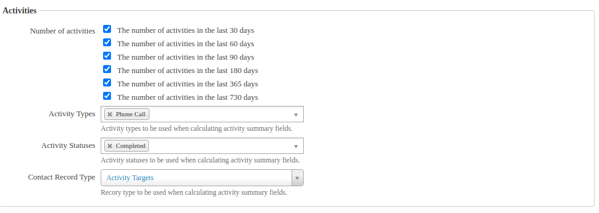

# sumfields-addon-activity

This extension provides additional summary fields for calculating the number of activities in the given last n days, and
the date of the last activity. The type of the activities, the status of the activities and the role of the contact
could be configured on the summary fields admin screen `Administer > Customize Data and Screens > Summary Fields`.

The extension is licensed under [AGPL-3.0](LICENSE.txt).

## Activity fields

You can set them on the `Summary Fields Administration` form. This form can be reached from
the `Administer > Customize Data and Screens > Summary Fields` menu.

**Activity Fields**



### Settings

The configuration is stored in a setting database. The setting storage provided by the sumfields extension uses
deprecated solution, that causes deprecation log entries and test execution errors, so that i decided to replace it in
this implementation.

- Activity Types - The selected activity types (you can choose multiple) will be counted. If you left it empty, it will
  fallback to every activity type.
- Activity Statuses - The selected activity statuses (you can choose multiple) will be counted. If you left it empty, it
  will fallback to every activity status.
- Activity Record Type - The selected participant role (you can choose only one) will be counted. (source, target or
  assignee)

### Number of activities fields

- The number of activities in the last 30 days.
- The number of activities in the last 60 days.
- The number of activities in the last 90 days.
- The number of activities in the last 180 days.
- The number of activities in the last 365 days.
- The number of activities in the last 730 days.

### Date of activities fields

- The date of the last activity.

## Requirements

* PHP v7.4+
* CiviCRM v5.43
* net.ourpowerbase.sumfields

## Installation (CLI, Git)

Sysadmins and developers may clone the [Git](https://en.wikipedia.org/wiki/Git) repo for this extension and install it
with the command-line tool [cv](https://github.com/civicrm/cv).

```bash
git clone https://github.com/reflexive-communications/sumfields-addon-activity.git
cv en sumfields-addon-activity
```

## Changes

- In v1.1.0 the setting database has been extended with the date of activity configuration keys.
